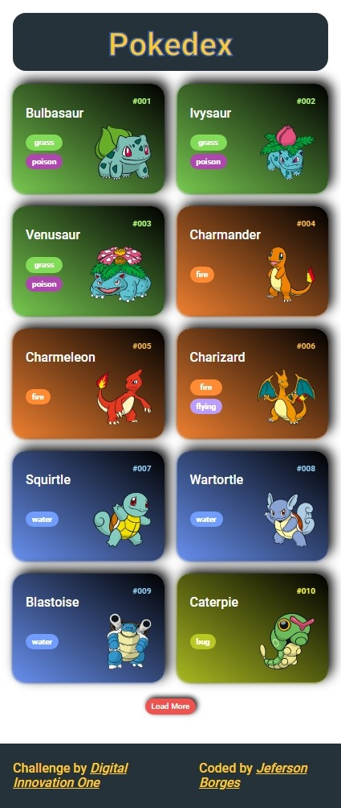
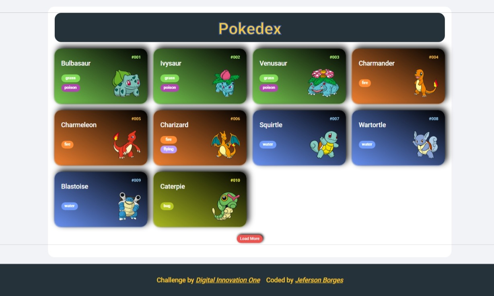
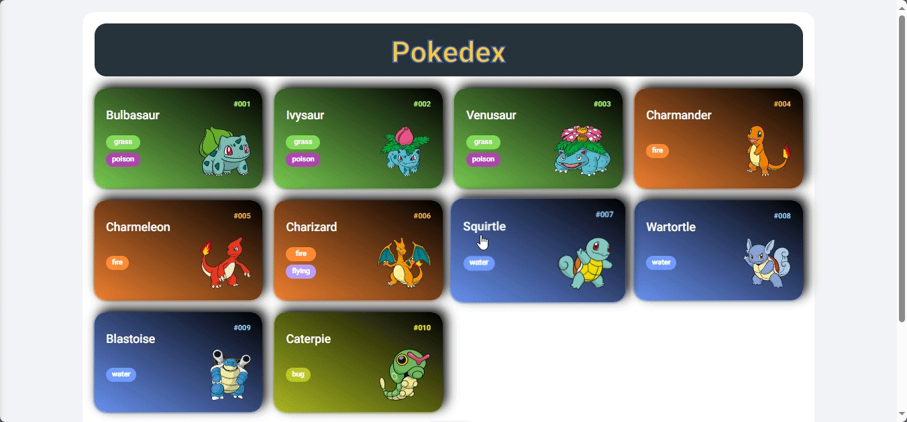

# Trilha JS Developer - Pokedex

height - decimetros
weight - hectogramas - 1hg = 0,1kg = 100g
abilities - lista
base stats - lista

->abilidades aprendidas
dialog html tag
meter html tag
description list html dl com dd e dt tags
spread operator com nodeList
integração com projeto já existente
number.toString().padStart(charNumber,prefix)
css inset
css variables

\#frontend
\#desenvolvimento
\#webdevelopment
\#programacao
\#programming
\#web
\#javascript
\#html
\#css
\#sass
\#DataVisualization
\#FrontendMentor
\#CodeChallenge

---

## Sumário

- [Visão geral](#visão-geral)
  - [Desafio](#desafio)
  - [Screenshots](#screenshot)
    - [Mobile](#mobile)
    - [Desktop](#desktop)
    - [Active states](#active-states)
  - [Links](#links)
- [Meu processo](#meu-processo)
  - [Built with](#built-with)
  - [What I learned](#what-i-learned)
- [Autor](#autor)

## Visão geral

Atividade proposta no módulo **primeiras páginas interativas com JavaScript**, presente no **Bootcamp Santander + DIO: Formação Full Stack com Java e Angular.**

### Desafio

O desafio consiste em implementar uma página que exiba uma listagem de pokemons, consumindo dados de uma API externa. Ao clicar em um pokemon da lista, deverá ser exibido as informações detalhadas a respeito deste pokemon.

Recursos disponíveis ao usuário:

- Visualizar a listagem de pokemons em dispositivos móveis
- Carregar pokemons com o botão "load more"
- Visualizar card com as informações detalhadas do pokemon ao clicar sobre o mesmo

### Screenshot

#### Mobile



#### Desktop



#### Active states



### Links

- Solution URL: [Github repository](https://github.com/jefersonBorges/fem-expenses-chart)
- Live Site URL: [Github live page](https://jefersonborges.github.io/fem-expenses-chart/)

## Meu processo

### Built with

- Semantic HTML5 markup
- Flexbox
- SASS
- JavaScript
  - DOM
  - OOP
  - Async
  - ES6 Features

### What I learned

Using JS Dom to generate the chart elements was very fun!

```js

//starts after the page content is loaded
generateChart(){

    //loads the data.json containing the expenses entry values
    this.getChartData(this.params.source)
    .then(
      response => {
        
        const amounts = response.map(element => element.amount);

        //based on the highest amount calculates the unit height for the chart bar
        const barHeightUnit = this.calculateBarHeightUnit(amounts) 

        return {response, barHeightUnit}
      }
    )
    .then(
      chartData => {

        chartData.response.forEach(
          data => {

            const amount = `$${data.amount}`
            const barHeight = `${this.calculateBarHeight(chartData.barHeightUnit, data.amount)}px`
            const day = data.day

            //create the chart column for each expense entry value
            const newColumn = this.chartElements.column(amount, barHeight, day)
            this.$chartPlotArea.appendChild(newColumn)
          }
        )
      }
    )
  },
```

## Autor

- GitHub - [jefersonBorges](https://github.com/jefersonBorges/jefersonBorges)
- Frontend Mentor - [@jefersonBorges](https://www.frontendmentor.io/profile/jefersonBorges)
- Linkedin - [Jeferson Borges Linkedin](https://www.linkedin.com/in/jeferson-borges-543b34229)
- DIO profile - [DIO profile](https://www.dio.me/users/borges_jeferson)

---
